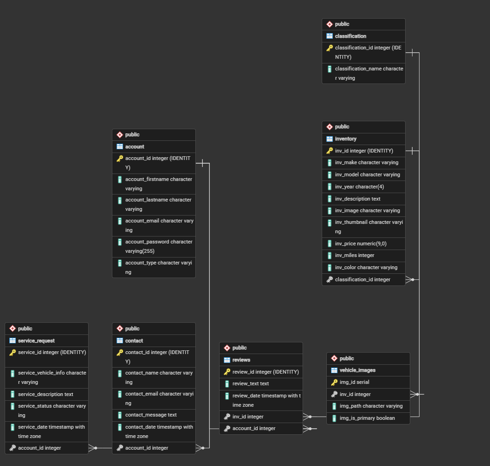

# 🚗 CSE 340 Used Car Dealership Web Application

A fully functional, database-driven web application built as the final project for CSE 340 (Web Backend Development). This application simulates a real-world used car dealership where public users can browse vehicles, logged-in clients can leave reviews and track service requests, and employees/admins can moderate content, edit inventory, and manage client workflows.

---

## 🔗 Live Deployment
* **Live Site on Render:** [Insert Live Render URL Here]

---

## 🛠️ Technology Stack
* **Runtime Environment:** Node.js
* **Backend Framework:** Express.js (MVC Architecture)
* **Templating Engine:** EJS (Server-Side Rendered)
* **Database:** PostgreSQL (with parameterized queries for SQL injection prevention)
* **Authentication:** Session-based using `express-session` & `connect-pg-simple` (Passwords hashed via `bcrypt`)
* **Module System:** ES Modules (ESM - `import`/`export`)

---

## 👥 User Roles & Access Control

| Role | Permissions & Capabilities |
| :--- | :--- |
| **Standard User (Client)** | • Register/Login • View vehicle listings • Post, edit, and delete their own vehicle reviews • Submit and view their personal vehicle service requests |
| **Employee** | • All standard user features • View full inventory lists • **Edit vehicle specifications** (price, description, mileage, color, etc.) • **Moderate customer reviews** (edit or delete any review) • Manage and update service request workflows |
| **Admin (Owner)** | • All employee privileges • **Full CRUD control over inventory** (Add, Edit, and Delete categories and vehicles) • Manage system users and elevated permissions |

---

## 🔑 Test Account Credentials
*To test the authorization restrictions of each user role, use the credentials below. All accounts use the standard testing password.*

* **Standard Password for all accounts:** `Mypassword123!`

### 👤 Standard Client Account
* **Email:** `user@cse340.edu`

### 🛠️ Employee Account
* **Email:** `employee@cse340.edu`

### 👑 Admin / Owner Account
* **Email:** `admin@cse340.edu`

---

## 📐 Database Schema (ERD)

---

## ⚠️ Known Limitations & Notes
* **Vehicle Images:** New vehicle images are handled by downloading the asset files directly to the local system, placing them into the project's images folder, and matching their file names to the corresponding image path names stored in the database.